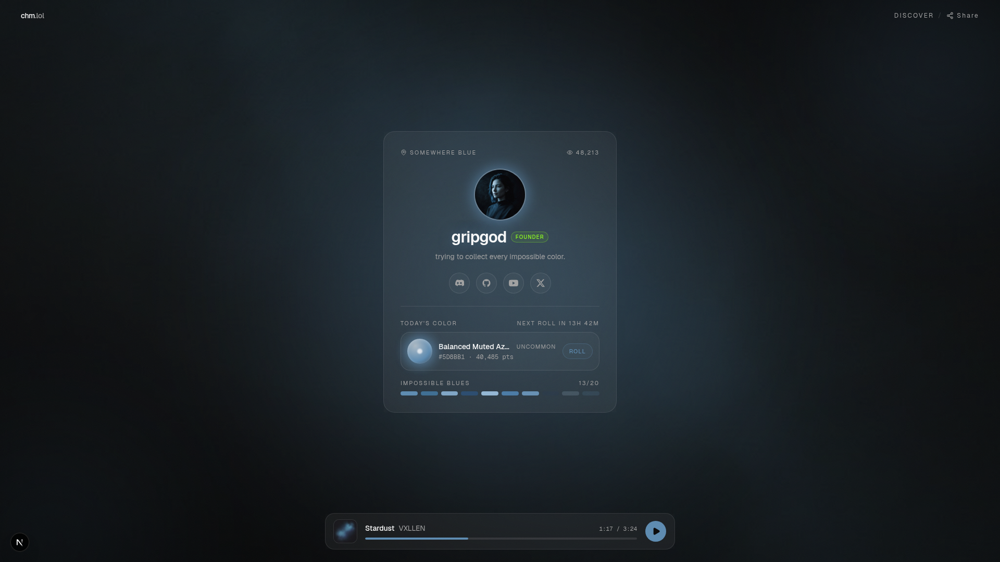
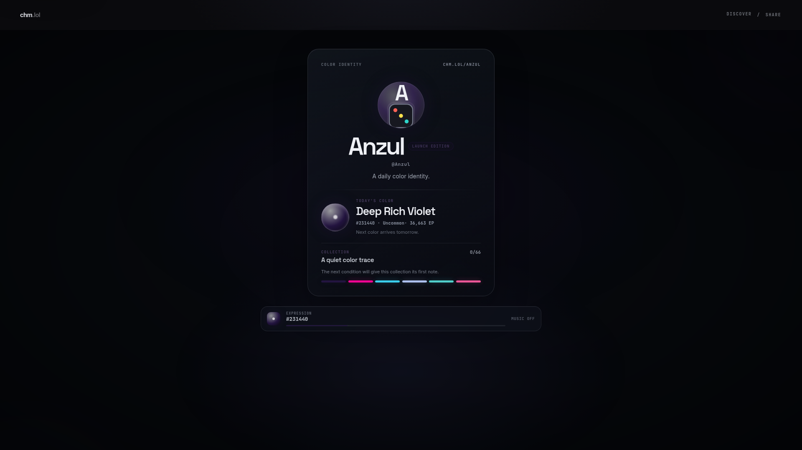
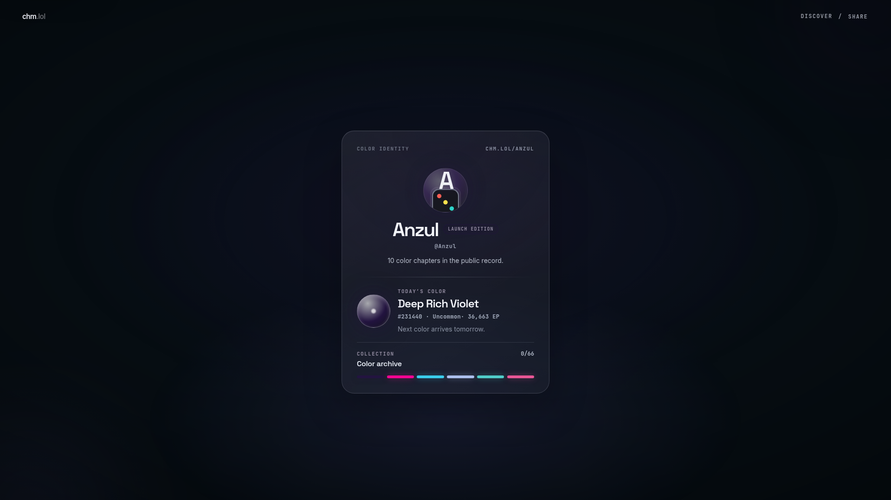
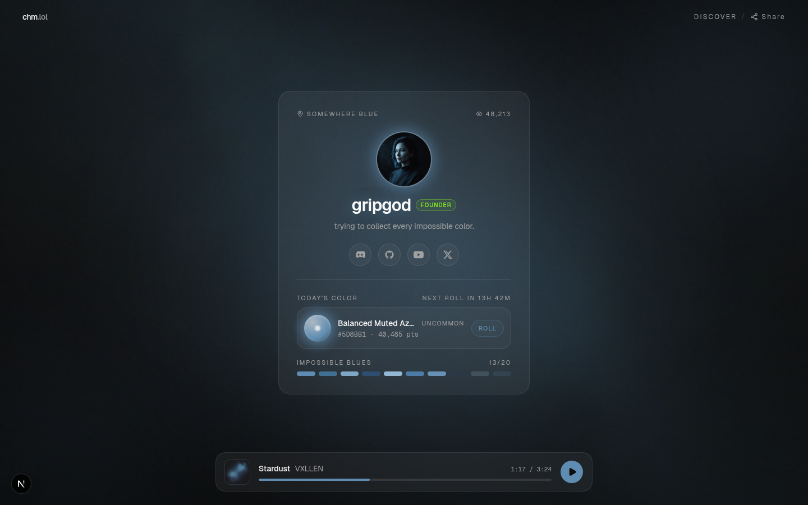
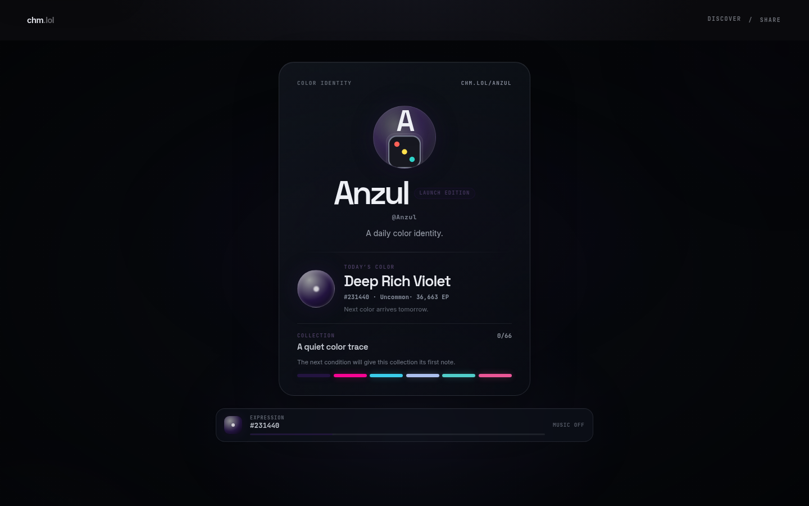
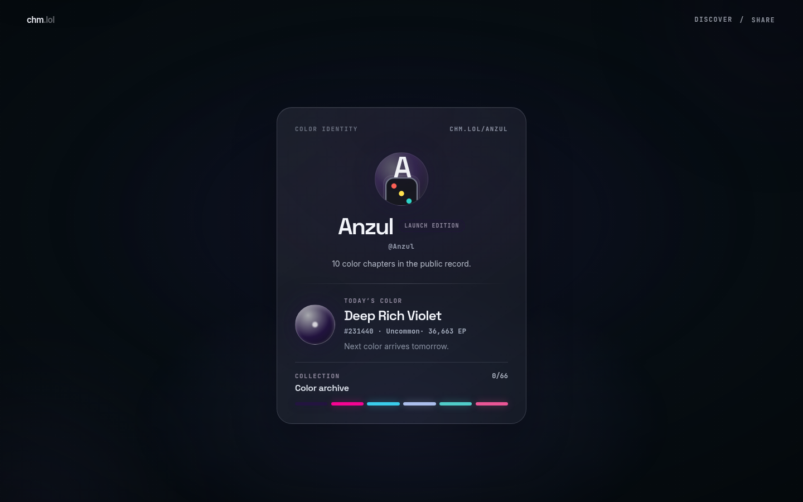

# Phase 11.1 visual comparison

All production captures use the real mapped `/u/Anzul` profile. The approved
reference captures use the local frontend-only mockup. Chromium was run at
browser zoom 100%, `deviceScaleFactor: 1`, CDP page scale 1, and
`devicePixelRatio: 1`.

## Primary desktop comparison

| Approved reference | Current-before production | Corrected production visitor |
|---|---|---|
|  |  |  |

| Approved reference at 1440×900 | Current-before production at 1440×900 | Corrected visitor at 1440×900 |
|---|---|---|
|  |  |  |

The reference-to-production measurement record is in
[`docs/PHASE_11_1_VISUAL_AUDIT.md`](../../docs/PHASE_11_1_VISUAL_AUDIT.md). The
post-change computed-style audit is in
[`final-audit/metrics.json`](final-audit/metrics.json).

## Corrected production states

| State | 1920×1080 | 1440×900 | 1280×720 | 390×844 |
|---|---|---|---|---|
| Visitor, completed result | [PNG](corrected-visitor-final/1920x1080.png) | [PNG](corrected-visitor-final/1440x900.png) | [PNG](corrected-visitor-final/1280x720.png) | [PNG](corrected-visitor-final/390x844.png) |
| Owner, completed result | [PNG](corrected-owner-final/1920x1080.png) | [PNG](corrected-owner-final/1440x900.png) | [PNG](corrected-owner-final/1280x720.png) | [PNG](corrected-owner-final/390x844.png) |
| Owner, pre-roll | [PNG](corrected-pre-roll-final/1920x1080.png) | [PNG](corrected-pre-roll-final/1440x900.png) | [PNG](corrected-pre-roll-final/1280x720.png) | [PNG](corrected-pre-roll-final/390x844.png) |
| Explicit expression fixture | [PNG](corrected-expression-fixture-final/1920x1080.png) | [PNG](corrected-expression-fixture-final/1440x900.png) | [PNG](corrected-expression-fixture-final/1280x720.png) | [PNG](corrected-expression-fixture-final/390x844.png) |
| Reduced motion | [PNG](corrected-reduced-motion/1920x1080-reduced-motion.png) | [PNG](corrected-reduced-motion/1440x900-reduced-motion.png) | [PNG](corrected-reduced-motion/1280x720-reduced-motion.png) | [PNG](corrected-reduced-motion/390x844-reduced-motion.png) |

## Missing optional expression

The default visitor capture is also the missing-optional-expression state:
there is no configured music or expression provider, so the lower bar is
omitted and the profile rebalances without a `Music off` placeholder.

- [Missing optional expression — 1920×1080](missing-optional-expression/1920x1080.png)
- [Missing optional expression — 1440×900](missing-optional-expression/1440x900.png)
- [State notes](missing-optional-expression/README.md)

## Interpretation

The correction changes composition, scale, atmosphere, and fallback treatment;
it does not copy the mockup’s account, avatar, social, track, playback, or
local-roll data. The expression fixture is a local visual-only state and is
not enabled by the production `PROFILE_MUSIC_ENABLED` flag.
