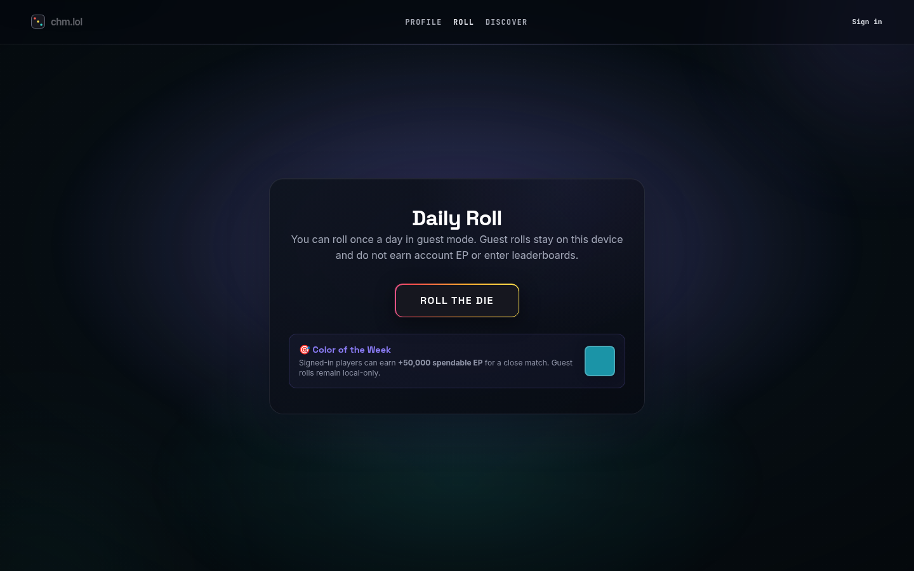
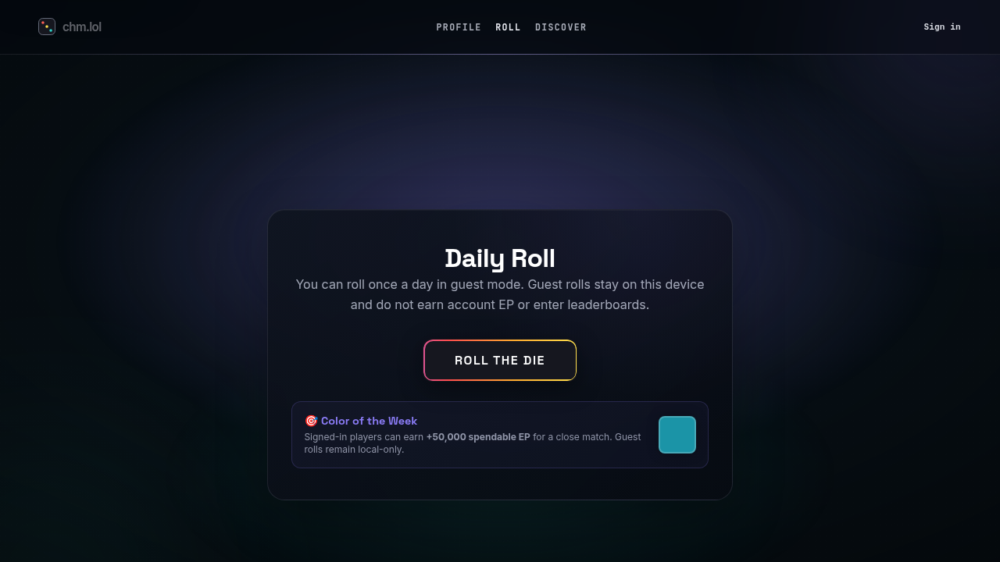
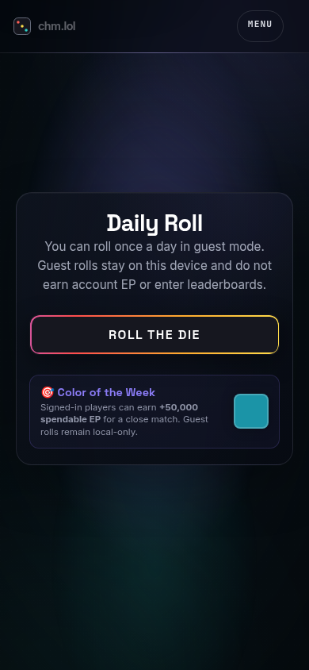
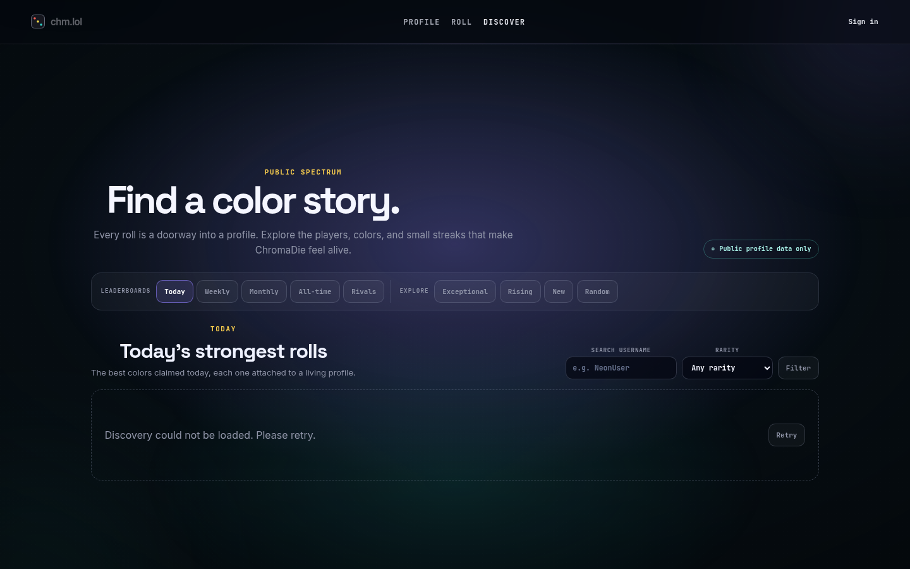
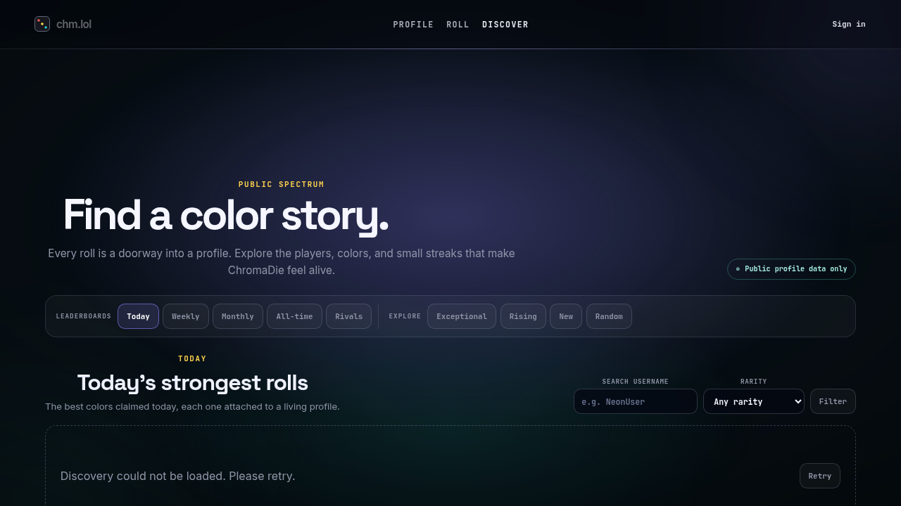
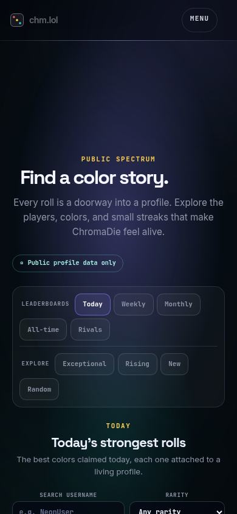
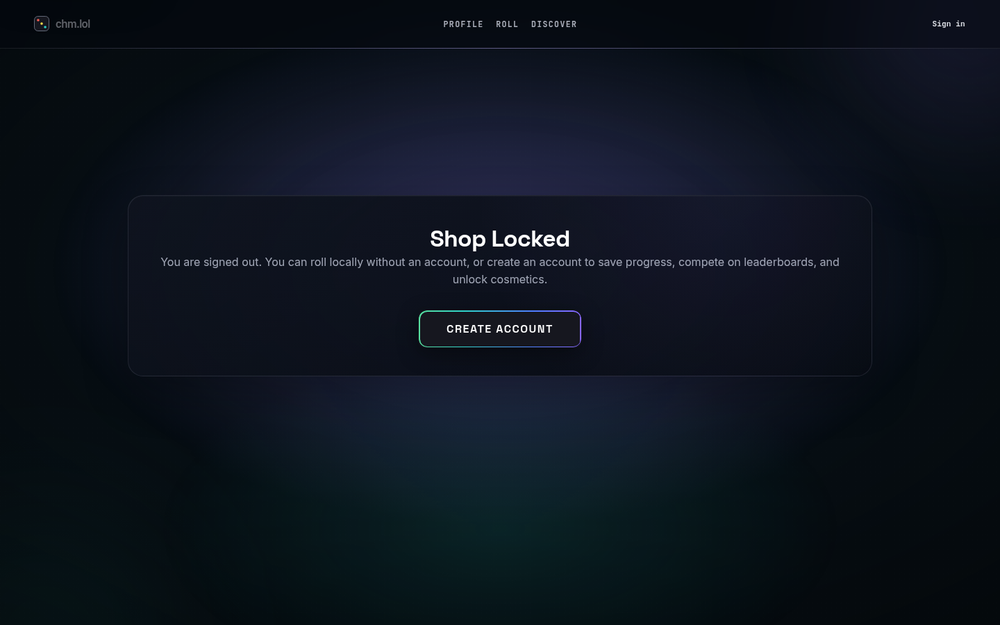
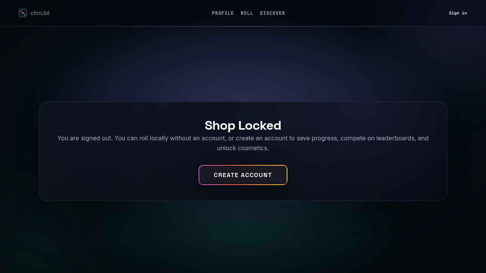
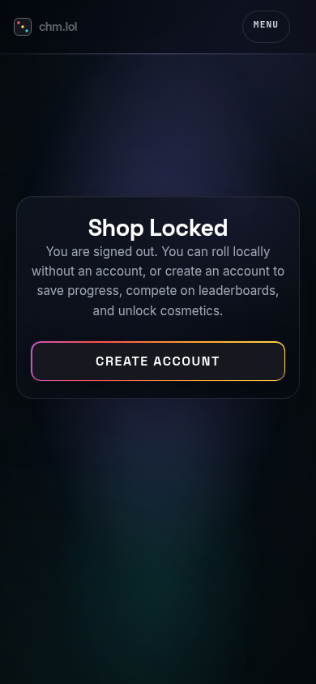

# Phase 12 Visual Comparison

All captures use Chromium at browser zoom 100%, CDP page scale 1, and
`deviceScaleFactor: 1`.

## First-visit guest Roll

| 1440×900 | 1280×720 | 390×844 |
| --- | --- | --- |
|  |  |  |

## Discover

| 1440×900 | 1280×720 | 390×844 |
| --- | --- | --- |
|  |  |  |

## Signed-out Studio boundary

| 1440×900 | 1280×720 | 390×844 |
| --- | --- | --- |
|  |  |  |

`metrics.json` in each surface directory records the viewport and document
scroll heights. Profile screenshots from the approved composition remain in
[`artifacts/phase-11-1/`](../phase-11-1/); they were not overwritten.
